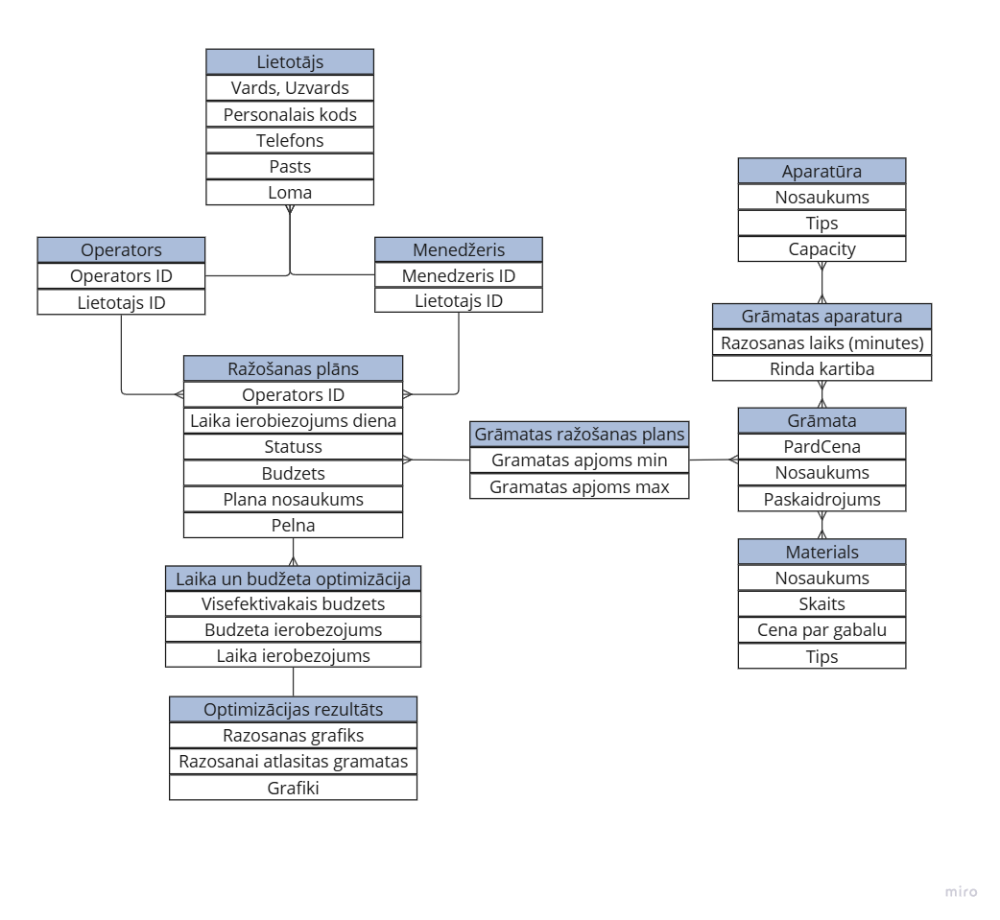

## Izvēlēta problēmsituācija: Drukāšanas pasūtījumu izpildes plānošana

Dalībnieki:
Aleksandrs Kozaļetovs, 
Anastasija Ostrovska, 
Sofija Kamuškina, 
Edvards Bārtulis, 
Anželika Krasiļņikova.

# Ievads

Mūsdienu drukāšanas industrija saskaras ar vairākām izaicinājumiem, kas saistīti ar ražošanas efektivitātes palielināšanu un resursu optimizāciju. Lēmumu pieņemšana par to, cik daudz un kuras grāmatas ražot, nereti ir sarežgīts process, jo tas prasa ņemt vērā daudzas mainīgās: pieprasījuma prognozes, izmaksu struktūras, noliktavas iespējas un tirgus tendences. Nepareizi pieņemti lēmumi var izraisīt gan zaudējumus, gan neizmantotas peļņas iespējas.

Šī projekta ietvaros tika izstrādāta drukāšanas optimizācijas lietotne, kas paredzēta drukāšanas ražotņu darbības efektivitātes uzlabošanai un peļņas maksimizācijai. Lietotne analizē datus, aprēķina optimālo ražošanas apjomu un sniedz ieteikumus, cik izvelētas grāmatas ražot, lai sasniegtu maksimālu ekonomisko izdevīgumu īsākā laikā.

## Problēmas nostādne

Drukāšanas ražotņu galvenā problēma ir ierobežotie resursi un pieaugošā konkurence tirgū. Lai sasniegtu maksimālu peļņu, ir nepieciešams efektīvi izmantot pieejamos resursus, ņemot vērā gan pieprasījuma izmaiņas, gan ražošanas izmaksu struktūras. Tomēr tradicionālā lēmumu pieņemšana bieži vien ir balstīta uz intuitīviem pieņēmumiem, kas var novest pie neprecīziem rezultātiem.

## Darba un novērtēšanas mērķis

Darba mērķis ir izveidot efektīvu un praktisku drukāšanas optimizācijas rīku, kas:

1. **Sniedz datus balstītus ieteikumus**, kādos apjomos grāmatas ražot, lai sasniegtu maksimālu peļņu.
2. **Samazina izmaksas** ar automatizētu datu analīzi un prognozēšanas algoritmiem.
3. **Uzlabo lēmumu pieņemšanas procesu**, samazinot cilvēka pieļauto kļūdu iespējamību un laika patēriņu.

Projekta rezultāti sniegs ieguldījumu drukāšanas industrijas attīstībā, sekmējot tehnoloģiju izmantošanu lēmumu pieņemšanas procesos.

# Lidzīgo risinājumu parskats.
| Risinājums                                      | Īss apraksts                                                                                                                                                     | Svarīgākās iezīmes                                                                                                                                                  | Ierobežojumi                                                                           | Saite uz projektu                           |
| :---------------------------------------------- | :--------------------------------------------------------------------------------------------------------------------------------------------------------------- | :----------------------------------------------------------------------------------------------------------------------------------------------------------------- | :------------------------------------------------------------------------------------- | :------------------------------------------: |
| GitHub projekts "Surf" (no angļu valodas - sērfot) | Šajā projektā tika risināta optimizācijas problēma, īpaši dinamiskās programmēšanas jomā. Projekta uzdevums ir izvēlēties viļņus sērfošanai tā, lai maksimizētu iegūtos "laimes" punktus, ņemot vērā viļņu grafiku. Problēmas risināšanai tika izmantota objektorientēta programmēšana, dinamiskā programmēšana un kaudzes kārtošana. | <ul><li>Efektīva sistēma - spēj apstrādāt 300 000 datu punktus 798 milisekundēs</li><li>Projekta kods ir pieejams (Java programmēšanas valodā)</li><li>Resursu neietilpīgs risinājums</li></ul>  | <ul><li>Nav vizuālā risinājuma</li><li>Risinājums ir viens no iespējamiem optimizācijas algoritmiem</li></ul> | [GitHub projekts "Surf"](https://github.com/nhays89/Surf) |
| SkyPlanner APS | Ražošanas plānošanas un optimizācijas rīks, kas palīdz efektīvi pārvaldīt resursus un procesus ar mākslīgā intelekta palīdzību, kā arī piedāvā integrāciju ar citām ERP sistēmām un rīkiem. MI ņem vērā resursus un noteiktās prioritātes, lai uzlabotu ražošanas plānu un reaģētu uz izmaiņām reāllaikā. | <ul><li>Dinamiskas prioritātes plānošanas optimizācijai</li><li>Alternatīvas ražošanas ierīces, vienlaicīgai darbībai</li><li>Procesa pabeigšanas pakāpe, kas dod iespēju uzsāks nākamo procesu pēc noteiktas procentuālās daļas pabeigšanas</li><li>Grafiskais attēlojums</li></ul> | <ul><li>Nav atvērta pirmkoda </li><li>Procesa optimizācija neiekļauj tiešo peļņas maksimizēšanu <li>Dārgi mazajiem uzņēmumiem </li><li>Sarežģīta integrācija ar citām sistēmām</li><ul>| https://skyplanner.ai/ |
| MRPeasy | Ir viegli lietojama ERP (Enterprise Resource Planning) un MRP (Material Requirements Planning) sistēma, kas paredzēta maziem un vidējiem ražošanas uzņēmumiem. Tā palīdz pārvaldīt ražošanas procesus, noliktavas, piegādes ķēdes, kā arī finanšu un klientu attiecību vadību, nodrošinot pilnu uzņēmuma resursu plānošanu. | <ul><li> Ražošanas plānošana ar detalizētu ražošanas grafiku un spēju sekot līdzi katram ražošanas posmam un noslodzei.</li><li>Materiālu un inventāra pārvaldība, kas palīdz pārvaldīt krājumus, iepirkumus un piegādes ķēdes, lai nodrošinātu, ka resursi vienmēr ir pieejami.</li><li>Pasūtījumu un projektu vadība, kas ļauj viegli sekot līdzi pasūtījumiem un piegādēm, nodrošinot optimālu resursu sadali un termiņu ievērošanu.</li><li>Integrācijas ar citām sistēmām: Piemēram, ar grāmatvedības programmām kā QuickBooks un Xero.</li><ul> | <ul><li>MRPeasy var būt ierobežots uzņēmumiem ar sarežģītākām vajadzībām vai lielāku ražošanas apjomu.</li><li>Nepiedāvā sarežģītus algoritmus un dziļu analīzi</li><li>Ierobežota klientu atbalsta pieejamība</li></ul>| [MRPeasy](https://mrpeasy.com/) |
| Book Automation Suite | Book Automation Suite piedāvā automatizētu darbplūsmu, kā arī uzticamību visiem ražošanas posmiem, piemēram, pasūtījumu ievadīšanai, drukas datnei, pašai drukāšanai līdz pat apdarei. |<ul><li>Viegla integrācija esošajā sistēmu un iekārtu vidē.</li><li>Automātiska izvietošana un izvietošanas veidņu pielāgošana.</li><li>Automātiska iztrūkstošās pārlaides izveide.</li><li>Programmatūra izmanto metadatus, darba biļetes un svītrkodus kā darba plūsmas pamatu.</li><li>Automātiska drukas failu pārbaude un sagatavošana, tostarp kļūdu labošana.</li></ul> |<ul><li>Nav atvērta pirmkoda.</li></ul> | [OneVision](https://www.onevision.com/software-solutions/book-printing) |
| PlanProphet |PlanProphet ļauj pārvaldīt un uzturēt esošos klientus, izmantojot visus Printer's Plan programmatūras datus un klientu vēsturi. PlanProphet ir daudz vairāk nekā PRM un nodrošina jūsu komandai patiesu attiecību ar klientiem pārvaldību. Turklāt šī informācija ir attēlota grafiski, padarot to daudz ērtāku un vieglāk pārvaldāmu.|<ul><li>Programatura ir piemerota gan operatoriem, gan rakstītajiem, gan ražošanas vadītājiem.</li></ul>|<ul><li>Nav atvērta pirmkoda.</li><li>Risinājums ir dargs</li></ul>|[PlanProphet](https://www.planprophet.com/2023/05/17/integration-of-printers-plan-software-with-planprophet-as-your-management-solution/)|
| The Scheduler | The Scheduler ir veidots, lai optimizētu darbnīcu un darba plānošanas procesus, izmantojot intuitīvu digitālo interfeisu, kuru darbina reāllaika dati un AI automatizācija. Tas nodrošina reāllaika pārskatus, sniedzot ieskatus, kas palīdz identificēt problēmas un novērtēt plānošanas rezultātus. Mākslīgais intelekts ļauj atrast gandrīz optimālus risinājumus dažādām biznesa vajadzībām, piemēram, izmaksu samazināšanai un efektīvai maiņu plānošanai. | <ul><li>AI optimizē grafikus, lai tie atbilstu piegādes termiņiem, samazinot krājumus un nodrošinot produktu svaigumu.</li><li>AI sagrupē līdzīgus produktus, lai samazinātu iestatīšanas laiku un palielinātu efektivitāti.</li><li>Plānotājs palīdz līdzsvarot darbaspēku, uzrādot nepietiekamu vai pārmērīgu darbinieku skaitu ražošanas līnijās.</li><li>Nodrošina reāllaika datus par grafika ievērošanu, OTIF un apkopi. </li><li>Izseko galvenos rādītājus, lai ieplānotu proaktīvu apkopi un izvairītos no bojājumiem.</li><li>Samazina izmaksas par vairāk nekā 20%, palielina ražošanu līdz pat 50% un samazina neplānotas dīkstāves.</li></ul> | <ul><li>Rīkam nav atvērta koda.</li><li>Atkarība no precīziem datiem: AI vadītās plānošanas efektivitāte lielā mērā ir atkarīga no precīzas un atjauninātas datu ievades. Bez uzticamiem vēsturiskiem datiem un nepārtrauktas uzraudzības rīks var nesniegt optimālus rezultātus, izraisot neefektīvus grafikus.</li><li>Pielāgošanas vajadzības: rīkam var būt nepieciešama ievērojama sākotnējā konfigurācija un pielāgošana, lai tas lieliski atbilstu uzņēmuma specifiskajiem procesiem. Tas var būt resursietilpīgs, jo īpaši uzņēmumiem ar ļoti specializētām darbplūsmām.</li><li>Sarežģītība neparedzētu izmaiņu apstrādē: lai gan plānotājs ļauj veikt korekcijas reāllaikā, tas var cīnīties ar ļoti pēkšņiem, liela mēroga traucējumiem vai neparedzamām ražošanas izmaiņām.</li><li>Mācību līkne lietotājiem: neskatoties uz to, ka viņiem ir lietotājam draudzīgs interfeiss, darbiniekiem joprojām var būt nepieciešams laiks, lai apgūtu visas tā uzlabotās funkcijas.</li></ul> | [The Scheduler](https://scw.ai/product/scheduler/) |

# Tehniskais risinājums
## Lietotāju stāsti
| Nr. | Stāsts                                                                                                                                                                                      | Prioritāte      | Izpildīts |
|-----|---------------------------------------------------------------------------------------------------------------------------------------------------------------------------------------------|-----------------|-----------|
|   1.| Operators vēlas redzēt pieprasījuma plānu un drukāšanas secību, jo tas palīdz sakārtot un optimizēt darba procesu                                                                           | Must have       | Ir        |
|	  2.| Menedžeris vēlas rediģēt pieprasījumu un iekārtu sarakstu, jo tas ļauj personalizēt un koriģēt procesu                                                                                      | Must have       | Ir        |
|	  3.| Ražošanas vadītājs vēlas maksimizēt peļņu īsākā laikā, jo tas ir svarīgi uzņēmumam                                                                                                          | Must have       | Ir        |
|	  4.| Operators vēlas stabilu pieslēgumu mājaslapai, jo tas samazina darba pārtraukumus                                                                                                           | Should have     | Daļēji    |
|	  5.| Menedžeris vēlas redzēt un mainīt plāna izpildi, jo tas atvieglo sekošanu darba plānam                                                                                                      | Should have     | Daļēji    |
|	  6.| Menedžeris vēlas zināt iekārtas izmantošanu, jo jāzina, kuras mašīnas kādam operatoram jāpiešķir                                                                                            | Should have     | Ir        |
|	  7.| Ražošanas vadītājs vēlas redzēt izgatavoto grāmatu skaitu, jo tas palīdz novērtēt ražotnes peļņu                                                                                            | Should have     | Ir        |
| 	8.| Administrators vēlas aizsargāt privātdatus, jo pastāv datu zādzības un kiberuzbrukumu draudi                                                                                                | Should have     | Ir        |
|	  9.| Administrators vēlas veidot lietotāja līmeņus, jo katram darbiniekam jābūt piekļuvei atbilstošai informācijai                                                                               | Should have     | Daļēji    |
|  10.| Menedžeris vēlas zināt pieejamos materiālus, jo tas ļauj noteikt, cik grāmatas var saražot                                                                                                  | Should have     | Daļēji    |
|  11.| Menedžeris vēlas redzēt optimāla risinājuma pamatojumu, jo tas pierāda plāna uzticamību un algoritmu saprotamību                                                                            | Should have     | Ir        |
|  12.| Operators vēlas zināt mašīnas pieejamību, jo tas optimizē darba procesu                                                                                                                     | Could have      | Nav       |
|  13.| Operators vēlas redzēt instrukcijas plānā, jo jāzina darba secība katrai grāmatai                                                                                                           | Could have      | Ir        |
|  14.| Menedžeris vēlas redzēt alternatīvas peļņas un drukāšanas iespējas, jo ir svarīgi analizēt izvēles iespējas                                                                                 | Could have      | Ir        |
|  15.| Menedžeris vēlas redzēt grāmatu veidu un daudzumu vēsturi, jo tas palīdz analizēt drukāšanas plānošanu                                                                                      | Could have      | Ir        |
|  16.| Ražošanas vadītājs vēlas zināt gada ienākumus, jo tas ļauj novērtēt produktivitāti un rentabilitāti                                                                                         | Could have      | Nav       |
|  17.| Menedžeris vēlas zināt darba plānu uz noteiktu laiku, jo tas palīdz plānot darbinieku darba laiku un resursus                                                                               | Could have      | Daļēji    |
|  18.| Menedžeris vēlas redzēt aktuālo informāciju par grāmatu popularitāti, jo tas palīdz pieņemt lēmumus par drukāšanas procesu                                                                  | Would not have  | Nav       |
|  19.| Menedžeris vēlas zināt pārdošanas prognozes, jo tas ļauj optimizēt ražošanas procesu                                                                                                        | Would not have  | Nav       |

## Algoritma apraksts
Šis algoritms optimizē ražošanas plānus, pamatojoties uz budžetu vai laika ierobežojumiem. Optimizācija tiek veikta, izmantojot griezumu metodi (dichotomy) un grāmatu atlasīšanu pēc prioritātes (peļņa uz minūti). Galvenās funkcijas ir budžeta optimizācija, laika optimizācija un efektivitātes optimizācija. Lai atrastu visoptimālāko risinājumu, tiek izmantota divdaļīgā (binārā) meklēšana, kas ļauj efektīvi noteikt labāko budžetu vai atbilstību laika ierobežojumam, vienlaikus nodrošinot precīzus aprēķinus ar minimāliem atmiņas izdevumiem.

## Optimizācija pēc budžeta
Optimizācijai pēc budžeta mērķis ir maksimizēt peļņu vai ieguvumu, pilnībā izlietojot pieejamo budžetu, neņemot vērā laika ierobežojumus. Algoritms sākas ar visu iespēju saraksta analīzi, nosakot to izmaksas un potenciālo peļņu. Pēc tam iespējas tiek sakārtotas pēc to efektivitātes – cik daudz peļņas tās rada uz vienu iztērēto vienību. Visefektīvākās iespējas tiek izvēlētas, līdz budžets ir izsmelts, nodrošinot maksimālu ieguldījuma atdevi.
Prieksrocība šai pieejai ir tā, ka ierobežota budžeta gadījumā mēs varam maksimizēt peļņu no pieejamā budžeta, neizmantojot pilnu darba dienu (piemēram, ja materiāli 8 darba dienām nav pietiekami, tiks izmantotas 7,7 dienas – praktiski 8 pilnas darba dienas).

## Optimizācija pēc laika
Optimizācijai pēc laika mērķis ir noteikt, kā vislabāk izmantot piešķirto budžetu konkrētam laika posmam. Šajā pieejā tiek ņemts vērā gan projektu vai aktivitāšu izmaksas, gan to izpildes laiks. Algoritms vispirms izvēlas iespējas, kas dod vislielāko peļņas efektivitāti konkrētajā laika periodā, pēc tam līdzsvaro izvēles, lai izmantotu visu budžetu. Ja aktivitāte nav pilnībā pabeidzama laika posmā, budžets tiek pielāgots tā, lai maksimāli izmantotu atlikušo laiku.
Šī pieeja ir piemērota, ja budžets ir elastīgs, bet ir svarīgi maksimāli izmantot noteiktu darba dienu skaitu (piemēram, lai paspētu līdz termiņam vai iesniegšanas laikam).

## Optimizācija pēc budžeta efektivitātes
Optimizācija pēc budžeta efektivitātes koncentrējas uz maksimālu peļņas koeficienta palielināšanu neatkarīgi no tā, vai viss budžets tiek izlietots. Šeit algoritms nosaka kopējo ieguvumu no katras iespējas un atlasīt tikai tās, kas dod visaugstāko koeficientu starp ieguldījumu un atdevi. Tā vietā, lai prioritizētu pilnīgu budžeta izmantošanu, tiek izvirzītas priekšplānā tās darbības, kas nodrošina vislielāko atdevi ar minimāliem ieguldījumiem.
Šī pieeja ir ideāli piemērota investīcijām – tā aprēķina kapitāla pieauguma koeficientu un izvēlas vērtības, kurās ieguldījums un peļņa atšķiras pēc iespējas vairāk reižu.

## Konceptu modelis

## Tehnoloģiju steks

# Programmatūras apraksts

## Piekļuve sistēmai
Lai izmantotu sistēmu, lietotājiem nepieciešams izveidot jaunu kontu. Visiem jaunajiem lietotājiem automātiski tiek piešķirtas operatora tiesības, kas ļauj veikt sākotnējās darbības sistēmā.

## Sistēmas galvenās funkcijas
Sistēmas galvenajā lapā ir pieejami visi ražošanas plāni:

- **Progresā esošie plāni**: Tie, kas šobrīd tiek realizēti.
- **Pabeigtie plāni**: Tie, kuru realizācija ir pabeigta.

Ražošanas plānu izveidei nepieciešama grāmatu pievienošana. Mājaslapas navigācija tiek veikta caur sānu paneli, kas atrodas lapas kreisajā pusē. Panelī pieejamas šādas galvenās sadaļas:

- **Plāni**
- **Grāmatas**
- **Materiāli**
- **Iekārtas**

### Grāmatu izveide
Grāmatu izveides process ietver atbilstošo materiālu un iekārtu pievienošanu. Lai veiktu sagatavošanās darbības, sekojiet šiem soļiem:

#### Materiālu pārvaldība
1. Atveriet cilni **"Materiāli"**.
2. Šeit redzams visu jau izveidoto materiālu saraksts.
3. Pievienojiet jaunu materiālu vai rediģējiet esošos, lai tos varētu izmantot grāmatu ražošanā.

#### Iekārtu pārvaldība
1. Atveriet cilni **"Iekārtas"**.
2. Šeit redzams visu pieejamo iekārtu saraksts.
3. Pievienojiet jaunu iekārtu vai rediģējiet esošās, lai tās būtu pieejamas grāmatu ražošanai.

#### Grāmatu pievienošana
1. Atveriet cilni **"Grāmatas"**.
2. Noklikšķiniet uz pogas **"Izveidot jaunu grāmatu"** un ievadiet informāciju par grāmatu.
3. Pievienojiet nepieciešamo informāciju par materiāliem un iekārtām.
4. Kad grāmata ir izveidota, var pāriet pie ražošanas plāna izveides.

### Ražošanas plānu izveide
Ražošanas plānu izveide ir pieejama tikai menedžeriem un administratoriem. Lai izveidotu jaunu plānu:

1. Atveriet cilni **"Plāni"**.
2. Noklikšķiniet uz pogas **"Add New Plan"** un ievadiet sekojošo informāciju:
   - **Plāna nosaukums**
   - **Operators**: Izvēlieties atbildīgo personu.
   - **Grāmatas**: Izvēlieties vienu vai vairākas grāmatas.
   - **Plāna realizācijas opcijas**

Pēc plāna izveides izvēlieties vienu no trim realizācijas iespējām:

- **Efiktīvākais budžets**: Sistēma piedāvā optimālu budžetu.
# Novērtējums 
# Secinājumi

